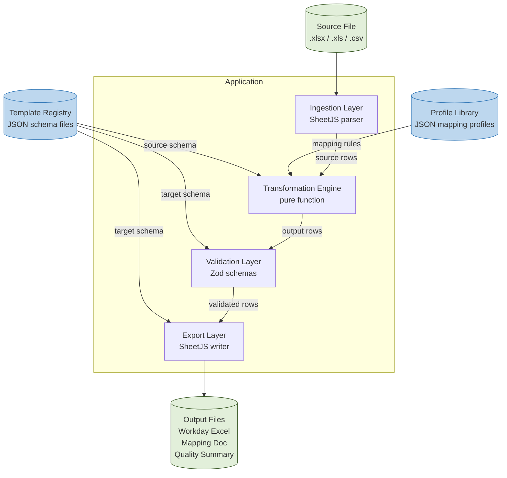
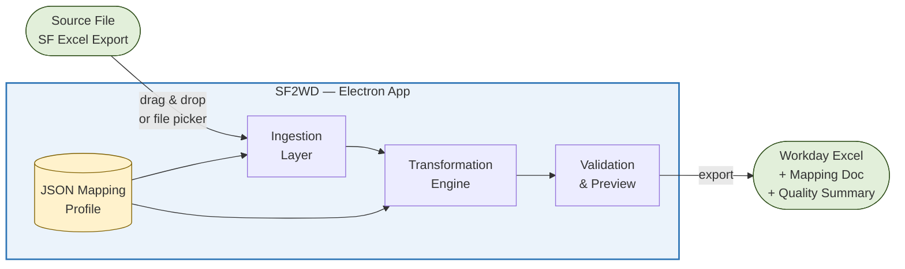
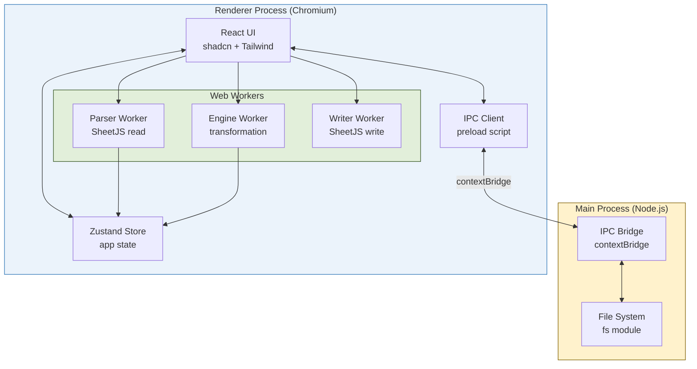
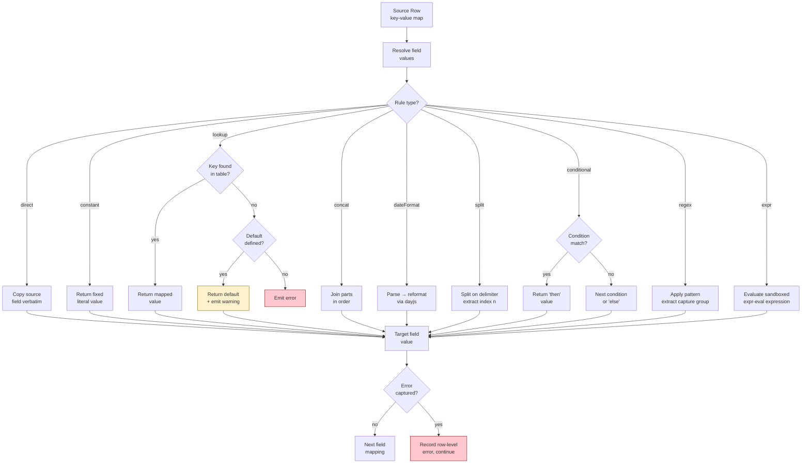
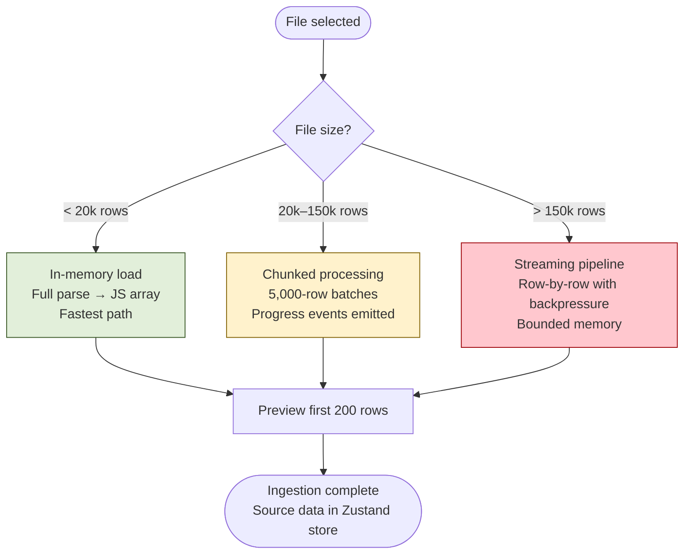
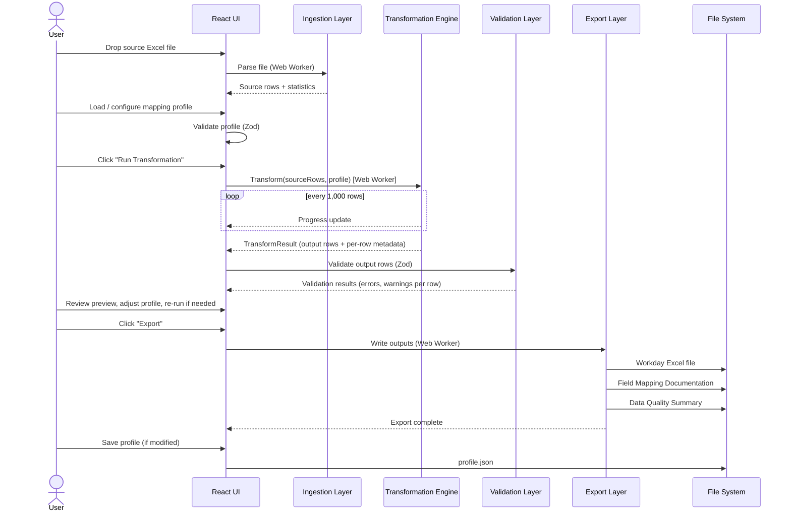
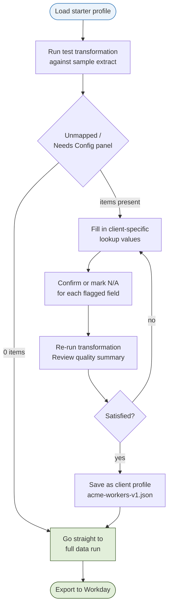

# SF2WD — SAP SuccessFactors → Workday Data Migration Tool
## Technical Design Document
**Version 0.2 — February 2026 — DRAFT**

| | |
|---|---|
| **Status** | DRAFT — For internal review and sign-off |
| **Version** | 0.2 |
| **Author** | SF2WD Team |
| **Date** | February 2026 |
| **Audience** | Delivery team, technical leads |
| **Next review** | Before development kickoff |

---

## Table of Contents

1. [Executive Summary](#1-executive-summary)
2. [Problem Statement](#2-problem-statement)
3. [Scope](#3-scope)
4. [Users & User Goals](#4-users--user-goals)
5. [Architecture](#5-architecture)
6. [Technology Stack](#6-technology-stack)
7. [Transformation Engine](#7-transformation-engine)
8. [Application Modules](#8-application-modules)
9. [End-to-End Data Flow](#9-end-to-end-data-flow)
10. [Profile Management & Reusability](#10-profile-management--reusability)
11. [Security & Privacy](#11-security--privacy)
12. [Packaging & Distribution](#12-packaging--distribution)
13. [Testing Strategy](#13-testing-strategy)
14. [Phased Roadmap](#14-phased-roadmap)
15. [Open Questions & Decisions Required](#15-open-questions--decisions-required)
16. [Appendix — Zod Profile Schema (Reference)](#16-appendix--zod-profile-schema-reference)

---

## 1. Executive Summary

SF2WD is a portable desktop application that bridges the gap between HR system data exports and HR system data import templates. It enables HR implementation teams to load source Excel extracts, define and apply configurable field-level transformation rules, validate the output against target schemas, and export ready-to-import files — all without any installation, internet connection, or third-party licence.

The first supported migration path is **SAP SuccessFactors → Workday**. The application is engineered to be system-agnostic from day one, so that new migration directions (WD→SF, SF→ADP, and others) are added by contributing new template schemas and starter profiles — with no changes to the engine or UI.

The tool is designed to serve two user types simultaneously: functional HR consultants who use a visual, point-and-click interface; and technical analysts who work directly with JSON configuration files that encode all mapping logic in a portable, version-controllable format.

---

## 2. Problem Statement

Migrations from SAP SuccessFactors to Workday are common but painful. The core challenges are:

| # | Problem | Impact |
|---|---|---|
| 1 | No dedicated tooling exists | Every engagement reinvents the wheel. Field mapping is done manually in Excel, is error-prone, and is not reusable. |
| 2 | Mapping logic is opaque | Transformation rules live inside consultant brains or undocumented Excel macros. They cannot be audited, transferred, or tested. |
| 3 | Workday templates are strict | EIB and CloudLoader files have precise structural requirements. Violations cause silent failures or rejected uploads. |
| 4 | Validation is too late | Data quality issues are typically discovered only after upload to a Workday tenant, triggering slow remediation cycles. |
| 5 | Tooling requires IT involvement | Generic ETL tools (Informatica, Talend) require infrastructure, licences, and engineering effort — disproportionate for a one-time migration. |

---

## 3. Scope

### 3.1 In Scope for v1.0

| Area | Detail |
|---|---|
| **Data Domains** | Employee / Worker core data; Organisational structure (org units, positions). Compensation and other domains deferred to v1.x. |
| **Source Format** | SAP SuccessFactors Excel exports (.xlsx, .xls, .csv). Single source file per mapping run in v1.0. Multi-source file merging is a planned v1.x feature; the ingestion layer is architected to accommodate it. |
| **Target Formats** | Workday EIB (flat sheet) and Workday CloudLoader (multi-tab relational). FTS Workbooks deferred to v1.x. |
| **Load Type** | Full initial loads (day-one migration). Delta/incremental loads anticipated but not implemented in v1.0. |
| **Data Volume** | Variable per client engagement. Adaptive processing: in-memory for small datasets, chunked/streaming pipeline for large datasets (100,000+ rows). See §8.1. |
| **Outputs** | Workday-ready Excel file; field mapping documentation for client sign-off; data quality summary with statistics. Audit log deferred. |
| **Platforms** | Windows (primary), macOS, Linux. No installer required on any platform. |

### 3.2 Explicitly Out of Scope for v1.0

- Direct API integration with SuccessFactors or Workday tenants
- Multi-source file merging — deferred to v1.x (architecture accommodates it)
- Audit log / per-row processing log — deferred
- Delta / incremental load support
- FTS Workbook export format
- Compensation, Time & Attendance, Learning, and Talent data domains
- Multi-user real-time collaboration or server-side storage
- Payroll data of any kind

---

## 4. Users & User Goals

| Persona | Profile | Primary Goals |
|---|---|---|
| **Functional Consultant** | HR generalist or SuccessFactors functional expert. Comfortable with Excel. No coding ability. | Load source files quickly; see a clear visual mapping; understand validation errors in plain language; export with confidence. |
| **Technical Analyst** | Implementation architect or data migration specialist. Writes JSON, understands data structures. | Define and maintain reusable mapping profiles; express complex transformation rules; version-control configuration; validate schemas. |

> **Note:** Both personas may work on the same engagement. The functional consultant performs day-to-day run operations; the technical analyst owns profile creation and maintenance. The UI must serve both without compromise.

---

## 5. Architecture

### 5.1 Architectural Philosophy

SF2WD follows three non-negotiable architectural constraints:

1. **Zero-install.** The application must run without any installation step, installer executable, or administrator privileges on any supported platform.
2. **Fully local.** No data ever leaves the user's machine. No network requests of any kind during normal operation.
3. **Configuration as code.** All mapping logic is expressed in portable JSON profiles that can be read, diffed, versioned, and shared without opening the application.

### 5.2 System-Agnostic Design

Although SF→WD is the first supported migration path, the application is engineered to be **direction-agnostic from day one**. The engine, UI, and export layer contain no knowledge of SAP SuccessFactors or Workday specifically. All system-specific knowledge is externalised into two artefact types:

| Artefact | Description |
|---|---|
| **Template Schema** | A JSON file describing one import or export format for one system: its field names, data types, required fields, allowed values, and structural constraints. Owned by the template registry. |
| **Mapping Profile** | A JSON file that references a source template and a target template, and defines the field-level transformation rules between them. Owned by the delivery team or community profile library. |

Adding a new migration direction — WD→SF, SF→ADP, ADP→WD — requires only:

1. Adding template schema JSON files for the new source and/or target system to the template registry
2. Contributing a starter mapping profile that pre-configures the standard field mappings for that direction
3. **Zero changes to the transformation engine, UI framework, or export layer**

> The profile's `source` and `target` fields are string identifiers referencing entries in the template registry — not hardcoded system names. `"sap-successfactors/ec-employee-export"` and `"workday/eib-worker"` are registry keys, not special values. Any registered template can be a source; any registered template can be a target.

#### 5.2.1 Template Registry Structure

```
templates/
  sap-successfactors/
    ec-employee-export.json      ← SF exporting workers (source)
    ec-org-export.json           ← SF exporting org units (source)
    ec-employee-import.json      ← SF importing workers (target, for reverse)
  workday/
    eib-worker.json              ← WD EIB import format (target)
    cloudloader-worker.json      ← WD CloudLoader format (target)
    eib-worker-export.json       ← WD exporting workers (source, for reverse)
    eib-org.json
    eib-position.json
  adp/                           ← future
  oracle-hcm/                    ← future

profiles/
  sf-to-wd/
    ec-worker-to-eib-worker.json
    ec-worker-to-cloudloader.json
    ec-org-to-eib-org.json
    ec-position-to-eib-position.json
  wd-to-sf/                      ← v1.x
  community/                     ← user-contributed
```

#### 5.2.2 Module Relationships



### 5.3 High-Level Data Flow



### 5.4 Process Isolation (Electron)

Electron provides two process types: the **Main Process** (Node.js, file system access) and the **Renderer Process** (Chromium, React UI). Communication uses Electron's `contextBridge` IPC.

| Responsibility | Process | Rationale |
|---|---|---|
| File open / save dialogs | Main (Node.js) | Native OS dialogs require Node.js fs access. |
| Excel parsing (SheetJS read) | Renderer (Worker thread) | Keeps UI responsive during large file parsing. |
| Transformation engine | Renderer (Worker thread) | CPU-intensive row processing runs off the main thread. |
| JSON profile load / save | Main (Node.js) via IPC | Profiles are files on disk; requires fs access routed through Main. |
| Excel generation (SheetJS write) | Renderer (Worker thread) | Large output files should not block the UI. |
| App state (Zustand store) | Renderer | All in-memory state lives in the Renderer. |



---

## 6. Technology Stack

| Layer | Technology | Rationale |
|---|---|---|
| **Application shell** | Electron 30+ | Packages Chromium + Node.js into a single portable folder. No-install executable on all three platforms. |
| **UI framework** | React 18 + Vite | Fast HMR during development. Vite bundles to static assets that Electron loads from disk. |
| **Component library** | shadcn/ui + Tailwind CSS | Accessible, headless components. No runtime CSS-in-JS penalty. Components are owned by the project. |
| **Excel (read + write)** | SheetJS (xlsx) | Single library for both reading source files and writing output files. Handles .xlsx, .xls, and .csv. Runs in browser and Node contexts. ExcelJS was considered but dropped — a single library is simpler and SheetJS write capabilities are sufficient for all v1.0 output formats. |
| **State management** | Zustand | Minimal boilerplate. Slice-based architecture suits our distinct state domains. |
| **Schema validation** | Zod | Runtime validation of mapping profiles and transformed rows. Human-readable error paths surface directly in the UI. The closest JS equivalent to Python's Pydantic. |
| **Expression evaluation** | expr-eval | Safe, sandboxed expression evaluator for the `expr` rule type. No arbitrary JS execution. |
| **Config persistence** | electron-store | Typed key-value store for UI preferences and recently opened profiles. |
| **Packaging** | electron-builder | Produces Windows portable .exe, macOS .app zip (universal binary), Linux .AppImage. All run without admin rights. |
| **Testing** | Vitest + React Testing Library + Playwright | Unit, component, integration, and E2E coverage. |

> **Note on SQL-based transformations:** A SQL/DSL approach was considered and rejected. SQL is expressive for set-based queries but our problem is fundamentally row-level and field-level. More critically, SQL strings are opaque to the application — a `CASE WHEN` expression cannot be rendered as a structured lookup table editor in the UI. The structured JSON rule approach lets the app understand each rule and render an appropriate editor widget. DuckDB-WASM is flagged as a v1.x option if cross-sheet JOIN operations become a real requirement.

---

## 7. Transformation Engine

### 7.1 Design Principles

- **Auditability:** every transformation decision is traceable to a specific rule in the profile
- **UI-friendliness:** the rule format is structured enough that the application can render a custom editor widget per rule type
- **Safety:** no arbitrary code execution — the engine is a pure interpreter of a constrained rule set
- **Testability:** given the same source row and profile, the engine always produces the same output (pure function, no side effects)
- **Consultant-readability:** a functional consultant can look at a profile and understand what each field mapping does

### 7.2 Rule Types

| Rule Type | Description | Example Use Case |
|---|---|---|
| `direct` | Copies the source field value to the target field verbatim. | `PERNR → Employee_ID` |
| `constant` | Writes a fixed literal value to every output row. | `Source_System = "SuccessFactors"` |
| `lookup` | Translates a source code to a Workday reference value via a named key-value table. Supports an optional default for unmatched values. | SF `PERSK` code `"1"` → WD `"Regular"` |
| `concat` | Joins an ordered list of source fields and/or literal string segments. | `FIRSTNAME + " " + LASTNAME → Full_Name` |
| `dateFormat` | Parses a source date string and re-serialises in a specified output format. Uses dayjs for locale-safe parsing. | `"20230115"` (YYYYMMDD) → `"01/15/2023"` (MM/DD/YYYY) |
| `split` | Splits a source string on a delimiter and extracts the segment at a given index (0-based). | `"DE-0042-FIN"` split on `"-"`, index `1` → `"0042"` |
| `conditional` | Evaluates a condition on a source field (equals, contains, regex match, isEmpty) and returns one of two values. Supports chained if/elif/else. | If `LAND1 = "DE"` → `"Germany"`; if `"FR"` → `"France"`; else → `LAND1` |
| `regex` | Applies a regular expression with a capture group to extract or reformat a portion of the source value. | Extract country dial code from `"+49 123 456"` → `"49"` |
| `expr` | Evaluates a sandboxed expression (via expr-eval) referencing source fields by name. For edge cases only. Requires `enableExprRules: true`. | `MONTHLY_SALARY * 12 → Annual_Salary` |

### 7.3 Rule Evaluation Flow



### 7.4 Mapping Profile Schema

#### 7.4.1 Top-Level Structure

```json
{
  "profileId":       "client-acme-workers-v3",
  "description":     "Worker core data — ACME Corp — Phase 1",
  "version":         "3",
  "createdAt":       "2026-02-01",
  "updatedAt":       "2026-02-20",
  "author":          "j.smith@consultancy.com",
  "source":          { "system": "sap-successfactors", "template": "ec-employee-export" },
  "target":          { "system": "workday", "template": "eib-worker" },
  "settings": {
    "onValidationError": "skip",
    "dateLocale":        "en-US",
    "emptySourceValue":  ["", null, "NULL", "N/A"],
    "enableExprRules":   false
  },
  "lookupTables":    { ... },
  "fieldMappings":   [ ... ]
}
```

#### 7.4.2 The `settings` Block

| Setting | Description |
|---|---|
| `onValidationError` | `"skip"` — omit errored rows from output but continue (default); `"halt"` — abort on first error; `"include"` — export all rows with error flag column. |
| `dateLocale` | BCP 47 locale string for dayjs date parsing (e.g. `"en-US"`, `"de-DE"`). Defaults to `"en-US"`. |
| `emptySourceValue` | Array of source values treated as "no value present". Used by `isEmpty` checks and lookup default logic. |
| `enableExprRules` | Must be `true` to use the `expr` rule type. Disabled by default to discourage overuse. |

#### 7.4.3 Lookup Tables

Defined once at the profile level, referenced by name from field mapping rules:

```json
"lookupTables": {
  "contractType": {
    "1": "Regular",
    "2": "Contractor",
    "3": "Intern"
  },
  "countryCode": {
    "DE": "Germany",
    "FR": "France",
    "GB": "United Kingdom"
  }
}
```

#### 7.4.4 Field Mapping Examples

```json
"fieldMappings": [
  { "targetField": "Employee_ID",
    "rule": { "type": "direct", "sourceField": "PERNR" } },

  { "targetField": "Source_System",
    "rule": { "type": "constant", "value": "SuccessFactors" } },

  { "targetField": "Contract_Type",
    "rule": { "type": "lookup", "sourceField": "PERSK",
              "table": "contractType", "default": "Regular",
              "onMissing": "warn" } },

  { "targetField": "Full_Name",
    "rule": { "type": "concat",
              "parts": ["FIRSTNAME", " ", "LASTNAME"] } },

  { "targetField": "Hire_Date",
    "rule": { "type": "dateFormat", "sourceField": "EINDT",
              "inputFormat": "YYYYMMDD", "outputFormat": "MM/DD/YYYY" } },

  { "targetField": "FTE_Type",
    "rule": { "type": "conditional",
              "conditions": [
                { "if": { "field": "VDSK1", "equals": "1" }, "then": "Full-Time" },
                { "if": { "field": "VDSK1", "equals": "2" }, "then": "Part-Time" }
              ],
              "else": "Full-Time" } },

  { "targetField": "Annual_Salary",
    "rule": { "type": "expr", "expression": "MONTHLY_SALARY * 12" },
    "notes": "Requires enableExprRules: true in settings" }
]
```

### 7.5 Engine Execution Flow

> The engine is a pure function: `(sourceRows[], profile) → TransformResult`. It has no side effects and no dependency on the UI or file system. Fully unit-testable in isolation.

1. **Resolve source row:** extract field values into a flat key-value map.
2. **For each `fieldMapping` in order:** evaluate the rule, capture any warnings.
3. **Collect output row:** assemble all target field values.
4. **Record result:** push output row (with source row index, warnings, errors) to the result set.
5. **Post-processing:** apply `onValidationError` policy.

---

## 8. Application Modules

### 8.1 Ingestion Layer

- Accepts `.xlsx`, `.xls`, and `.csv` via drag-and-drop or native OS file picker
- Parses with SheetJS in a Web Worker thread to keep the UI responsive
- Auto-detects sheet names and column headers from row 1
- Renders a paginated data preview table (first 200 rows) with column type inference
- Reports basic source statistics: row count, column count, columns with >10% empty values, duplicate rows

#### 8.1.1 Adaptive Volume Strategy



> Size thresholds (20k / 150k rows) are configurable constants, calibrated during the v0.1 POC based on client hardware. The ingestion layer registers source data in a named slot (`"primary"`) in the Zustand store. The v1.x multi-source merge feature will add additional named slots (`"secondary"`, etc.) without requiring changes to the engine or export layer.

### 8.2 Mapping Configuration UI

Two modes, selectable per user preference:

**Visual Mode (Functional Consultants)**
- Split-panel: source columns left, target template fields right
- Drag a source column onto a target field to create a direct mapping
- Rule type badge on each connection; clicking opens a context-aware rule editor panel
- The rule editor renders a different form per rule type (key-value table for `lookup`, format pickers for `dateFormat`, field list for `concat`)
- Unmapped required fields highlighted in amber; configuration errors in red
- "Completeness bar" shows percentage of required target fields mapped and valid
- Lookup table editor with import-from-CSV capability

**JSON Mode (Technical Analysts)**
- Monaco Editor (VS Code's editor component) embedded in the UI
- Live Zod schema validation with inline error squiggles
- Auto-completion for source field names and rule type names
- Bi-directional sync with Visual mode
- Can be used without a source file loaded (offline profile authoring)

### 8.3 Validation Layer

**Phase 1 — Profile Validation (pre-transform)**
- Validates the mapping profile JSON structure against the Zod profile schema
- Checks: required fields present, rule types valid, all lookup table names exist, all `sourceField` names present in the loaded file
- Hard errors block transformation; warnings are shown but do not block

**Phase 2 — Row Validation (post-transform)**
- Each output row validated against the Workday template schema (Zod-based)
- Checks: required fields populated, data types correct, string length within Workday limits, date values parseable, picklist values from allowed set
- Results stored per-row with severity (error, warning, info)

### 8.4 Preview & Error Review UI

- Virtual-scroll data grid (TanStack Table) — renders 200,000 rows without performance issues
- Cells colour-coded: white (clean), amber (warning), red (error)
- Filter bar: show only rows with errors, show only rows with warnings, filter by column
- Row detail panel: source values, applied rules, output values, and all validation messages for a row
- Summary strip: total rows, error count, warning count, export readiness status
- Bulk actions: mark all warnings as acknowledged, exclude selected rows from export

### 8.5 Export Layer

Three outputs produced on every export run, written atomically to the chosen output directory.

**Workday Excel Output**
- EIB: single flat sheet, Workday-mandated headers in row 1, data from row 2
- CloudLoader: multi-sheet workbook, one sheet per object type, linked by primary/foreign key columns
- Workday template schemas bundled as versioned JSON files

**Field Mapping Documentation (Excel — for client sign-off)**
- Cover sheet: profile metadata
- Field Mapping sheet: Target Field, Source Field, Rule Type, Rule Description (plain English), Required (Y/N), Notes
- Lookup Tables sheet: each named table as key→value columns
- Unmapped Required Fields sheet: target fields marked required with no mapping — critical sign-off checklist
- Can be generated before a source file is loaded (driven purely from the profile JSON)

**Data Quality Summary (Excel — with statistics)**
- Summary sheet: total rows, rows clean, rows with warnings, rows with errors, overall data readiness %
- Per-Field Error Rate table: count and % of rows failing validation per target field, sorted by error rate
- Lookup Miss Report: source values with no translation, fell back to default or errored
- Empty Source Field Report: % of rows where each source field was empty
- Row-Level Error Sample: first 100 rows with errors and error messages

**Export Behaviour on Validation Errors**

| Setting | Behaviour |
|---|---|
| `"skip"` (default) | Rows with errors excluded from Workday Excel. Export proceeds with all clean rows. |
| `"halt"` | Export aborted if any row has a validation error. No output files produced. |
| `"include"` | All rows written, including invalid ones. A `__SF2WD_Errors` column is appended. |

---

## 9. End-to-End Data Flow



---

## 10. Profile Management & Reusability

### 10.1 Profile Portability

- A profile is a self-contained `.json` file with no dependency on any specific machine, path, or environment
- Profiles can be shared via email, shared drive, or committed to Git
- The application ships with a library of starter profiles for common migration scenarios

### 10.2 Profile Versioning

- Each profile carries a `version` field and `updatedAt` timestamp for manual tracking
- Teams wanting full history should use Git — the application does not enforce version control internally
- When opening a profile that references a different Workday template version than bundled, the app warns and offers to auto-upgrade non-breaking differences

### 10.3 Bundled Starter Profiles & Pre-Configured Mappings

SF2WD ships with starter profiles that are **ready to run against a standard SuccessFactors export with zero manual configuration**. The goal is maximum out-of-the-box coverage: a consultant loads the appropriate starter profile, runs a transformation against a sample extract, and only needs to configure client-specific deviations.

#### Coverage Philosophy

- All standard fields with a direct, unambiguous correspondence are pre-mapped with `direct` rules
- Common date format conversions (SF YYYYMMDD → WD MM/DD/YYYY) are pre-configured
- Lookup tables for universally stable reference data (gender codes, employment status, country ISO codes) are pre-populated with standard values
- Fields requiring client-specific lookup values (pay grade, cost centre, business unit) have the rule type and source field pre-defined, with an **empty lookup table and a comment** indicating what values the consultant needs to fill in
- Fields with no standard mapping are listed as unmapped, appearing on the sign-off checklist

#### SF → Workday Starter Profiles (v1.0)

| Profile | Pre-configured mappings |
|---|---|
| `sf-ec-worker-to-wd-eib-worker` | ~45 field mappings: Employee ID, legal name, preferred name, date of birth, gender, hire date, termination date, employment type, FTE%, pay rate type, manager ID, location, department. Lookup tables pre-populated for gender (M/F/U), employment status, and 249 country ISO codes. |
| `sf-ec-worker-to-wd-cloudloader-worker` | Same field coverage restructured across CloudLoader tabs: Worker (identity), Worker\_Contact (address, phone, email), Employment (job details). Foreign key linkage between tabs pre-configured. |
| `sf-ec-org-to-wd-eib-org` | ~18 field mappings: org unit ID, name, parent org ID, org type, effective date, manager ID, location. Org type lookup table pre-populated for standard SF org unit types. |
| `sf-ec-position-to-wd-eib-position` | ~22 field mappings: position ID, title, org unit, job profile, worker type, FTE, location, hiring freeze flag, effective date. Job family and job profile fields flagged as requiring client-specific lookup configuration. |

#### Profile Customisation Workflow



#### Future Migration Paths (v1.x)

| Profile | Direction |
|---|---|
| `wd-eib-worker-to-sf-ec-employee` | Workday → SAP SuccessFactors (reverse migration) |
| `sf-ec-worker-to-adp-workforce` | SAP SuccessFactors → ADP Workforce Now |
| `adp-workforce-to-wd-eib-worker` | ADP Workforce Now → Workday |
| `sf-ec-worker-to-oracle-hcm` | SAP SuccessFactors → Oracle HCM Cloud |

> Each new migration path requires only new template schema files in the registry and a new starter profile JSON. No application code changes are needed. Community contributions of profiles for additional systems are explicitly supported via the `community/` directory.

---

## 11. Security & Privacy

- All data processing is entirely local. No employee data is transmitted to any external server, API, or cloud service at any point.
- The Electron app is configured with minimum required permissions: `fs` read/write for user-chosen files and the app data directory.
- `contextIsolation: true` and `nodeIntegration: false` enforced in the Renderer. All Node.js access via a narrow, explicitly-typed IPC preload bridge.
- No analytics, telemetry, crash reporting, or update checks involving network calls.
- The application functions fully in air-gapped environments.
- Sensitive data (employee PII) is held only in memory during a session and not persisted to disk by the application.

---

## 12. Packaging & Distribution

| Platform | Artefact | Notes |
|---|---|---|
| **Windows** | Portable `.exe` (no install) | Runs from any folder including a USB drive. No registry writes. No admin rights required. Optional NSIS installer available for managed IT environments. |
| **macOS** | `.app` bundle in `.zip` | Universal binary (Intel + Apple Silicon). Code-signed and notarised for Gatekeeper compliance. |
| **Linux** | `.AppImage` | `chmod +x` and run — no root access, no package manager. Tested on Ubuntu 22.04 LTS and RHEL 9. |

Distribution is as simple as zipping the output folder and sharing it. No installation, licence server, runtime dependency, or internet connection required.

---

## 13. Testing Strategy

| Test Type | Tool | What Is Tested |
|---|---|---|
| **Unit tests** | Vitest | All rule types (every branch), date format permutations, Zod profile schema, Workday template schemas, edge cases (empty values, null, type mismatches) |
| **Component tests** | Vitest + React Testing Library | Rule editor form per rule type, validation error display, profile load/save flows, preview grid row colouring |
| **Integration tests** | Vitest | End-to-end pipeline: sample SF source file → apply profile → validate output → compare against expected output fixture |
| **E2E tests** | Playwright (Electron) | Full user flows: load file → load profile → transform → export. Smoke tests on all three platforms. |
| **Performance tests** | Vitest + benchmark | Three tiers: 10k rows (small/in-memory), 50k rows (medium/chunked), 150k+ rows (large/streaming). UI must remain interactive throughout; peak memory ≤ 1.5 GB. Absolute time targets calibrated during v0.1 POC. |

---

## 14. Phased Roadmap

| Phase | Target | Scope |
|---|---|---|
| **v0.1** | Internal POC | Core ingestion (SheetJS), transformation engine with direct/lookup/constant/concat rules, EIB flat-sheet export, JSON profile editor only. **Template registry infrastructure established. System identifiers generic from day one.** |
| **v0.2** | Alpha | All 9 rule types including `expr`. Visual drag-and-drop mapping UI with per-rule editors. Post-transform row validation. Preview grid. Source statistics panel. **Starter profile library for SF→WD (4 profiles) with pre-configured standard field mappings.** |
| **v1.0** | First Release | CloudLoader multi-tab export. Mapping documentation and data quality summary exports. Monaco Editor JSON mode. Performance testing at 150k+ rows. macOS and Linux builds. Playwright E2E test suite. Community profile contribution guidelines published. |
| **v1.x** | Enhancements | **WD→SF reverse migration path (template schemas + starter profiles). Additional HR systems (ADP, Oracle HCM).** FTS Workbook export. Multi-source file merge. Delta/incremental load support. Compensation data domain. Profile inheritance. DuckDB-WASM for cross-sheet JOINs. |

---

## 15. Open Questions & Decisions Required

| # | Question | Recommendation |
|---|---|---|
| 1 | Should `expr` rules be disabled by default and require an explicit opt-in flag in profile settings? | ✅ **Yes.** Gate behind `settings.enableExprRules: true`. Discourages overuse; preserves capability for edge cases. |
| 2 | Should lookup tables be defined inline in the field mapping rule, or always at the profile level and referenced by name? | ✅ **Always profile-level (named tables).** Inline tables make profiles harder to read and duplicate data. |
| 3 | Which Workday template versions should be bundled at launch, and what is the update strategy when Workday releases schema changes? | ⚠️ **Requires scoping.** Bundle the two most recent Workday release versions. Provide a CLI script to update bundled schemas. Requires Workday partner access. |
| 4 | Should the app support a "web-only" mode as an alternative to the Electron binary, for clients with strict app-signing policies? | ⏳ **Deferred.** Design the React app Electron-agnostic at component level (IPC calls in a thin adapter layer) so web mode can be added later without architectural changes. |
| 5 | Should field mapping entries support a free-text `notes` field for documentation purposes? | ✅ **Yes** — low-cost addition that significantly improves the mapping documentation report. |
| 6 | The adaptive volume thresholds (20k / 150k rows) are initial estimates. Should they be hardcoded or user-configurable, and when should they be calibrated? | ⚠️ **Calibrate during v0.1 POC.** Expose as hidden developer settings initially; promote to user-configurable if clients report performance issues. |

---

## 16. Appendix — Zod Profile Schema (Reference)

The following Zod schema is the authoritative definition of the mapping profile format. Used both at runtime and by the Monaco Editor for live validation.

```typescript
const RuleSchema = z.discriminatedUnion("type", [
  z.object({ type: z.literal("direct"),      sourceField: z.string() }),
  z.object({ type: z.literal("constant"),    value: z.string() }),
  z.object({ type: z.literal("lookup"),      sourceField: z.string(),
             table: z.string(), default: z.string().optional(),
             onMissing: z.enum(["warn","error"]).default("warn") }),
  z.object({ type: z.literal("concat"),      parts: z.array(z.string()) }),
  z.object({ type: z.literal("dateFormat"),  sourceField: z.string(),
             inputFormat: z.string(), outputFormat: z.string() }),
  z.object({ type: z.literal("split"),       sourceField: z.string(),
             delimiter: z.string(), index: z.number().int().min(0) }),
  z.object({ type: z.literal("conditional"),
             conditions: z.array(z.object({
               if: z.object({ field: z.string(),
                 equals: z.string().optional(),
                 contains: z.string().optional(),
                 regex: z.string().optional(),
                 isEmpty: z.boolean().optional() }),
               then: z.string() })),
             else: z.string() }),
  z.object({ type: z.literal("regex"),       sourceField: z.string(),
             pattern: z.string(), captureGroup: z.number().default(1) }),
  z.object({ type: z.literal("expr"),        expression: z.string() }),
]);

const TemplateRefSchema = z.object({
  system:   z.string(),   // e.g. "sap-successfactors", "workday", "adp"
  template: z.string(),   // e.g. "ec-employee-export", "eib-worker"
});

const FieldMappingSchema = z.object({
  targetField: z.string(),
  rule:        RuleSchema,
  notes:       z.string().optional(),
});

const ProfileSchema = z.object({
  profileId:    z.string(),
  description:  z.string(),
  version:      z.string(),
  createdAt:    z.string(),
  updatedAt:    z.string(),
  author:       z.string().optional(),
  source:       TemplateRefSchema,
  target:       TemplateRefSchema,
  settings: z.object({
    onValidationError: z.enum(["skip","halt","include"]).default("skip"),
    dateLocale:        z.string().default("en-US"),
    emptySourceValue:  z.array(z.union([z.string(),z.null()])).default(["",null]),
    enableExprRules:   z.boolean().default(false),
  }).default({}),
  lookupTables:  z.record(z.string(), z.record(z.string(), z.string())),
  fieldMappings: z.array(FieldMappingSchema),
});
```

---

*SF2WD | Technical Design Document | v0.2 DRAFT | February 2026 | For internal review and sign-off*
